# Active Directory Help Desk Lab

## Project Overview

This lab simulates a small business Active Directory environment used for common Tier 1 help desk and system administration tasks. The environment includes a Windows Server domain controller, a domain-joined Windows client, Active Directory users and groups, Group Policy, shared folders, and DNS-based domain authentication.

---

## Step 1 — Create the Active Directory Organizational Structure

I created Organizational Units in Active Directory Users and Computers to organize users and computers within the domain.

This provides a structured way to manage accounts and apply policies to specific groups of systems or users.

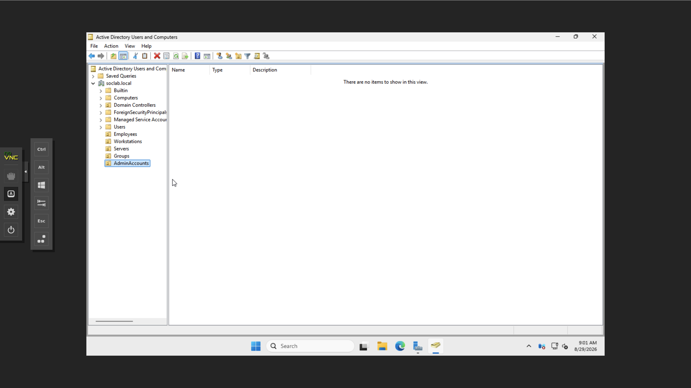

---

## Step 2 — Create a Domain User

I created a test employee account in Active Directory and configured the initial account information.

I then assigned an initial password for the account and configured the appropriate password options.

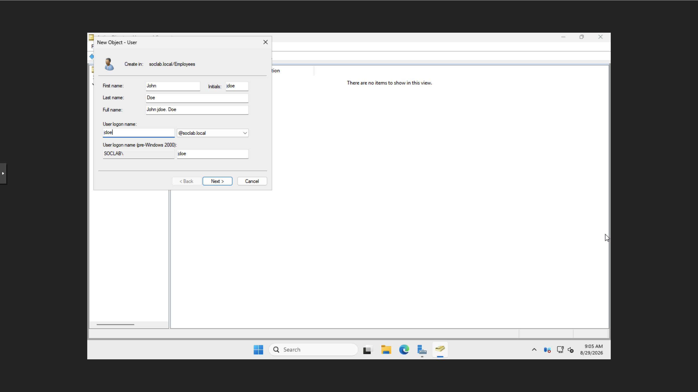
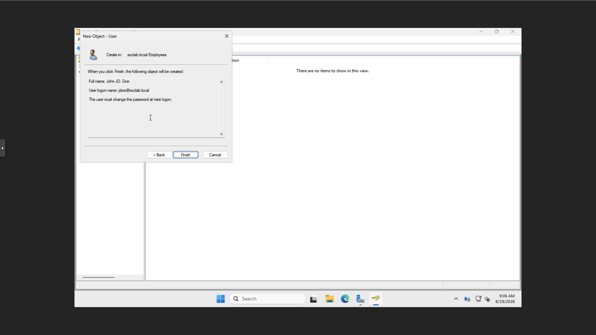

---

## Step 3 — Assign the User to a Security Group

I added the test user to an Active Directory security group.

Security groups can be used to manage access to shared resources without assigning permissions directly to individual users.

I verified that the user appeared as a member of the intended group.

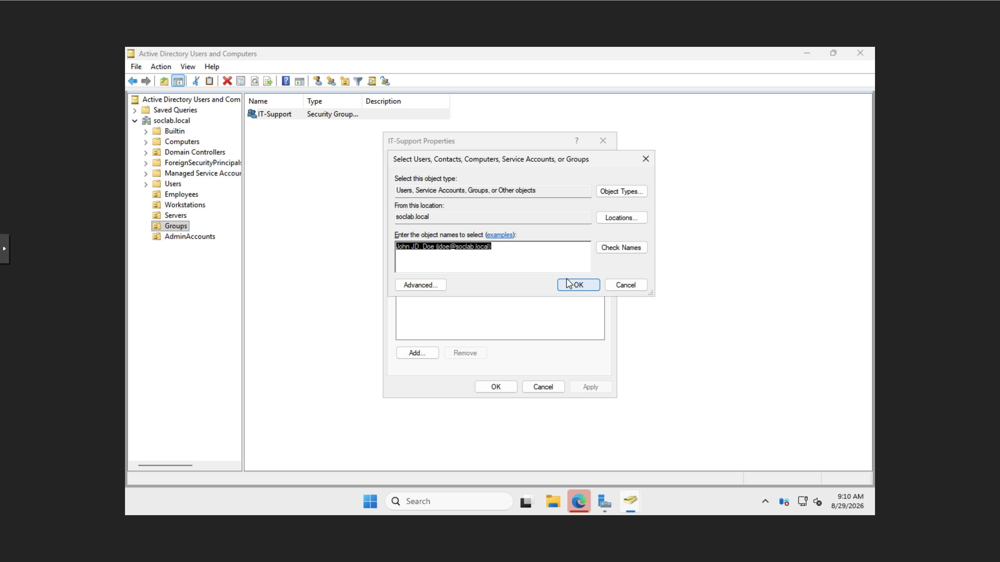
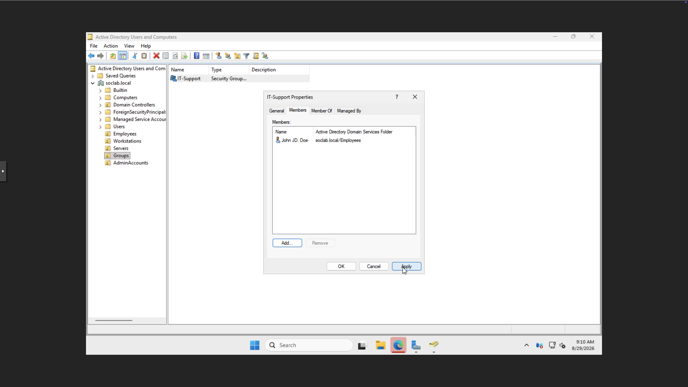

---

## Step 4 — Perform a Password Reset

I simulated a common help desk request by resetting the domain user's password through Active Directory Users and Computers.

This represents a typical Tier 1 task for users who forget their password or require an administrator-initiated reset.

**Screenshot:**
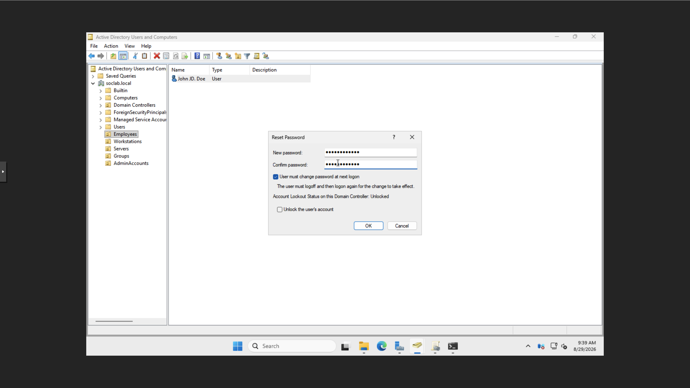

---

## Step 5 — Configure Shared Folder Access

I configured permissions for a network share using both share-level and NTFS permissions.

The permissions were assigned so access could be controlled through Active Directory security groups instead of individual user accounts.

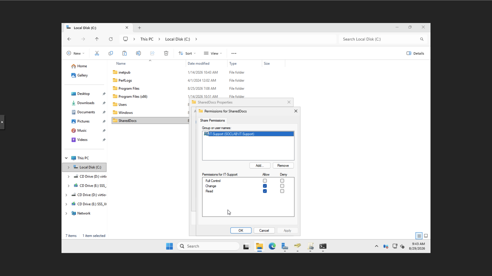
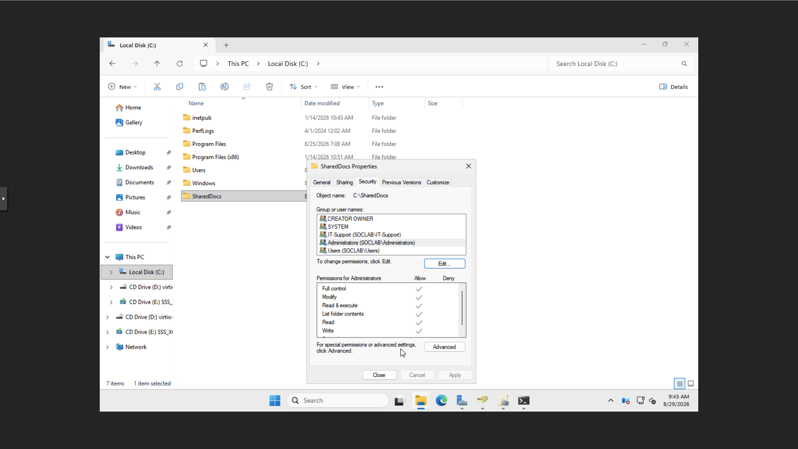

---

## Step 6 — Configure Group Policy

I created and linked a Group Policy Object to the domain.

Group Policy provides centralized control over Windows user and computer settings in an Active Directory environment.

I then used gpresult from the client system to inspect the policies and domain information being applied to the workstation.

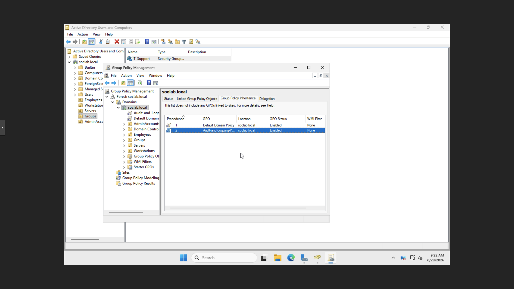
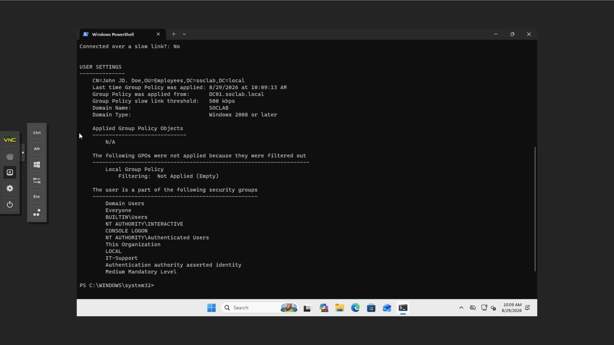

---

## Step 7 — Join a Windows Client to the Domain

I configured the Windows client to communicate with the domain controller and attempted to join it to the Active Directory domain.

Administrative domain credentials were provided to authorize the domain join.

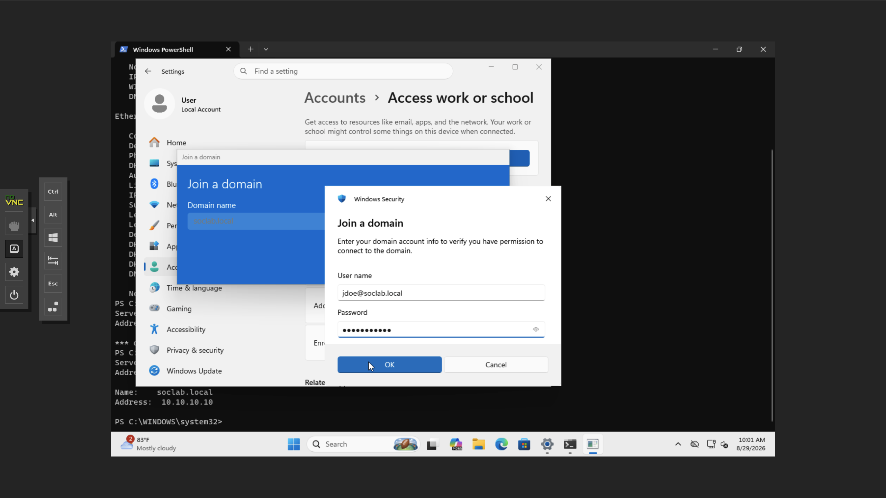
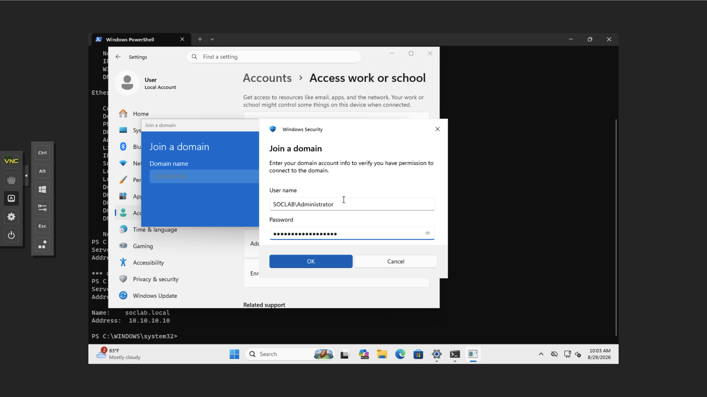

---

## Step 8 — Verify Domain Connectivity

After joining the workstation to the domain, I validated communication between the Windows client and the domain controller.

I used PowerShell to verify the secure channel between the client and Active Directory.

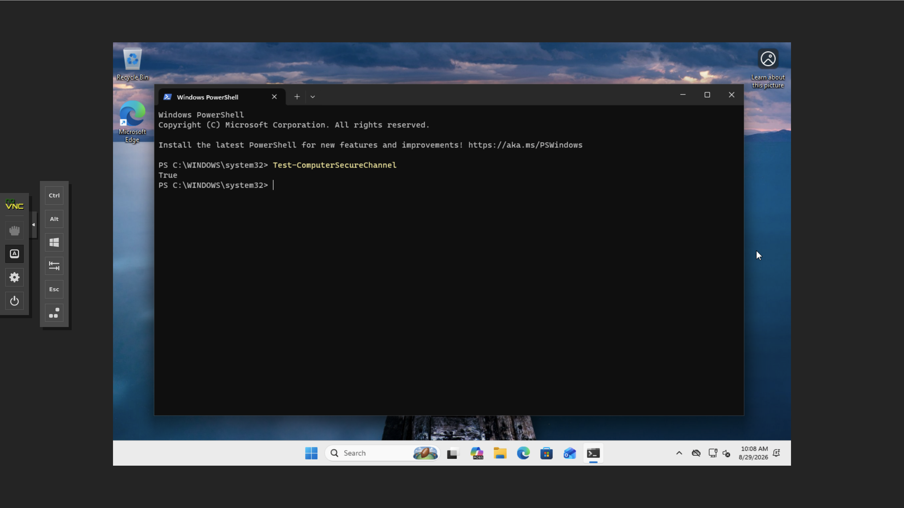

---

## Skills Demonstrated

* Active Directory Users and Computers
* User account creation
* Password resets
* Security groups
* Group membership management
* Organizational Units
* Domain joining
* DNS-dependent domain authentication
* Shared folders
* NTFS permissions
* Group Policy
* PowerShell
* Windows client administration
* Help desk account support
